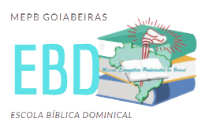
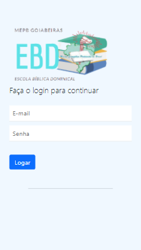
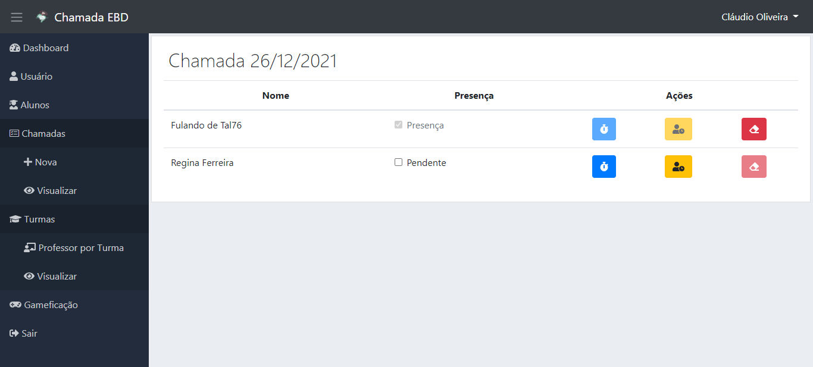

## Sobre o App Chamada EBD

O Chamada EBD foi criado para registrar a presença de alunos na Escola Bíblica Dominical e nas atividades escolares eclesiásticas.

O registro das presenças geram pontos em um sistema de gameficação para que os gestores possam mensurar a adesão (presenças) e bonificar aqueles com mais frequências.

Algumas funcionalidades

- Criação de usuários (ADM's,Professores e alunos)
- Criação de Turmas e associação de professores por turma
- Realização da chamada (Presença do aluno) e exclusão da chamada
- Opção de chamada por atraso
- Contagem dos pontos por presença - sistema de gameficação.

Tecnologias utilizadas:

Laravel, Bootstrap, javascript, HTML5, CSS3.

## Telas do Chamada EBD

Login

Tela inicial

Tela inicial mobile

Chamada

Chamada mobile

